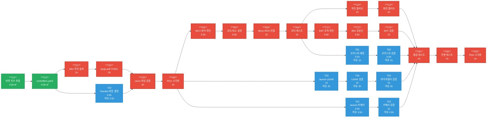

# 11. Cobra Flex 적용 일정 — WBS / CPM

> [!NOTE] 이 문서의 목적
> Cobra Flex 적용 작업 전체를 계층적으로 분류(WBS)하고,
> 작업 간 의존관계를 분석하여 주공정(Critical Path)을 도출한다.
> 일정 관리 및 우선순위 결정에 활용한다.

---

## 1. WBS (Work Breakdown Structure)

```
1.0  Cobra Flex 적용 프로젝트                                 [총 ~15h]
│
├── 1.1  컨트롤러 파라미터 수정                               [2.5h]
│   ├── 1.1.1  바퀴 치수 실측                                [0.5h] ✅
│   ├── 1.1.2  controllers.yaml 수정                         [0.5h] ✅
│   ├── 1.1.3  직진 캘리브레이션   ← MCU 통신(1.6) 이후 가능  [1.0h]
│   └── 1.1.4  회전 캘리브레이션   ← MCU 통신(1.6) 이후 가능  [0.5h]
│
├── 1.2  URDF 작성                                            [6.5h]
│   ├── 1.2.1  IMU 위치 실측                                 [1.0h]
│   ├── 1.2.2  body.urdf.xacro TODO 항목 처리                [2.0h]
│   ├── 1.2.3  ros2_control Gazebo 버전 결정                 [0.5h]
│   ├── 1.2.4  controllers.yaml wheel_separation 동기화      [0.5h]
│   ├── 1.2.5  xacro 파싱 검증                               [1.0h]
│   └── 1.2.6  RViz 시각화 검증                              [1.0h]
│
├── 1.3  LiDAR 통합                                           [3.0h]
│   ├── 1.3.1  하드웨어 연결 및 권한 설정                     [0.5h]
│   ├── 1.3.2  rplidar_ros 패키지 설치                       [0.5h]
│   ├── 1.3.3  bringup.launch.py 수정 (LiDAR)               [1.0h]
│   └── 1.3.4  LiDAR 동작 검증                               [1.0h]
│
├── 1.4  레이저 필터 설정                                      [2.0h]
│   ├── 1.4.1  로봇 풋프린트 치수 측정                        [0.5h]
│   ├── 1.4.2  laser_filter.yaml 수정                        [0.5h]
│   └── 1.4.3  레이저 필터 동작 검증                          [1.0h]
│
├── 1.5  카메라 통합                                           [2.5h]
│   ├── 1.5.1  OrbbecSDK_ROS2 설치                           [1.0h]
│   ├── 1.5.2  bringup.launch.py 수정 (카메라)               [0.5h]
│   └── 1.5.3  카메라 동작 검증                               [1.0h]
│
├── 1.6  MCU 통신 설정                                         [3.0h]
│   ├── 1.6.1  통신 방식 확인 (Micro-ROS/other)              [0.5h]
│   ├── 1.6.2  시리얼 포트 / Baud Rate 설정                  [0.5h]
│   ├── 1.6.3  Micro-ROS Agent 연결 검증                     [1.0h]
│   └── 1.6.4  모터 명령 전송 테스트                          [1.0h]
│
├── 1.7  EKF 파라미터 설정                                     [2.0h]
│   ├── 1.7.1  토픽 이름 확인                                 [0.5h]
│   ├── 1.7.2  IMU 공분산 확인                                [0.5h]
│   └── 1.7.3  EKF 동작 검증                                 [1.0h]
│
├── 1.8  조이스틱 설정                                         [1.0h]
│   ├── 1.8.1  버튼/축 매핑 확인                              [0.5h]
│   └── 1.8.2  동작 검증                                     [0.5h]
│
└── 1.9  최종 통합 검증                                        [4.0h]
    ├── 1.9.1  전체 시스템 시작 및 컨트롤러 확인               [2.0h]
    ├── 1.9.2  주행 테스트 (1m 직진, 360° 회전)               [1.0h]
    └── 1.9.3  RViz 종합 시각화 확인                          [1.0h]
```

> 예상 소요 시간은 **경험자 기준**. 시행착오 포함 시 **1.5~2배** 여유 권장.

---

## 2. 작업 목록 및 CPM 데이터

> **시간 단위**: 시간(h) | ES=빠른 시작, EF=빠른 완료, LS=늦은 시작, LF=늦은 완료, Float=여유

| ID | WBS | 작업명 | 시간(h) | 선행 | ES | EF | LS | LF | Float | CP |
|----|-----|--------|--------|------|----|----|----|----|-------|----|
| T11 | 1.1.1 | 바퀴 치수 실측 | 0.5 | — | 0 | 0.5 | 0 | 0.5 | 0 | ✅ |
| T12 | 1.1.2 | controllers.yaml 수정 | 0.5 | T11 | 0.5 | 1.0 | 0.5 | 1.0 | 0 | ✅ |
| T21 | 1.2.1 | IMU 위치 실측 | 1.0 | T12 | 1.0 | 2.0 | 1.0 | 2.0 | 0 | ✅ |
| T22 | 1.2.2 | body.urdf TODO 처리 | 2.0 | T21 | 2.0 | 4.0 | 2.0 | 4.0 | 0 | ✅ |
| T23 | 1.2.3 | Gazebo 버전 결정 | 0.5 | T12 | 1.0 | 1.5 | 3.5 | 4.0 | 2.5 | |
| T24 | 1.2.4 | controllers.yaml 동기화 | 0.5 | T11 | 0.5 | 1.0 | 10.5 | 11.0 | 10.0 | |
| T25 | 1.2.5 | xacro 파싱 검증 | 1.0 | T22, T23 | 4.0 | 5.0 | 4.0 | 5.0 | 0 | ✅ |
| T26 | 1.2.6 | RViz 시각화 검증 | 1.0 | T25 | 5.0 | 6.0 | 5.0 | 6.0 | 0 | ✅ |
| T31 | 1.3.1 | LiDAR 하드웨어 설정 | 0.5 | — | 0 | 0.5 | 7.0 | 7.5 | 7.0 | |
| T32 | 1.3.2 | rplidar_ros 설치 | 0.5 | T31 | 0.5 | 1.0 | 7.5 | 8.0 | 7.0 | |
| T33 | 1.3.3 | launch 수정 (LiDAR) | 1.0 | T26, T32 | 6.0 | 7.0 | 8.0 | 9.0 | 2.0 | |
| T34 | 1.3.4 | LiDAR 동작 검증 | 1.0 | T33 | 7.0 | 8.0 | 9.0 | 10.0 | 2.0 | |
| T41 | 1.4.1 | 풋프린트 치수 측정 | 0.5 | — | 0 | 0.5 | 9.0 | 9.5 | 9.0 | |
| T42 | 1.4.2 | laser_filter.yaml 수정 | 0.5 | T41 | 0.5 | 1.0 | 9.5 | 10.0 | 9.0 | |
| T43 | 1.4.3 | 레이저 필터 검증 | 1.0 | T34, T42 | 8.0 | 9.0 | 10.0 | 11.0 | 2.0 | |
| T51 | 1.5.1 | OrbbecSDK 설치 | 1.0 | — | 0 | 1.0 | 8.5 | 9.5 | 8.5 | |
| T52 | 1.5.2 | launch 수정 (카메라) | 0.5 | T26, T51 | 6.0 | 6.5 | 9.5 | 10.0 | 3.5 | |
| T53 | 1.5.3 | 카메라 동작 검증 | 1.0 | T52 | 6.5 | 7.5 | 10.0 | 11.0 | 3.5 | |
| T61 | 1.6.1 | MCU 통신 방식 확인 | 0.5 | T26 | 6.0 | 6.5 | 6.0 | 6.5 | 0 | ✅ |
| T62 | 1.6.2 | 포트/Baud Rate 설정 | 0.5 | T61 | 6.5 | 7.0 | 6.5 | 7.0 | 0 | ✅ |
| T63 | 1.6.3 | Micro-ROS 연결 검증 | 1.0 | T62 | 7.0 | 8.0 | 7.0 | 8.0 | 0 | ✅ |
| T64 | 1.6.4 | 모터 명령 테스트 | 1.0 | T63 | 8.0 | 9.0 | 8.0 | 9.0 | 0 | ✅ |
| T13 | 1.1.3 | 직진 캘리브레이션 | 1.0 | T64 | 9.0 | 10.0 | 9.0 | 10.0 | 0 | ✅ |
| T14 | 1.1.4 | 회전 캘리브레이션 | 1.0 | T13 | 10.0 | 11.0 | 10.0 | 11.0 | 0 | ✅ |
| T71 | 1.7.1 | EKF 토픽 이름 확인 | 0.5 | T64 | 9.0 | 9.5 | 9.0 | 9.5 | 0 | ✅ |
| T72 | 1.7.2 | IMU 공분산 확인 | 0.5 | T71 | 9.5 | 10.0 | 9.5 | 10.0 | 0 | ✅ |
| T73 | 1.7.3 | EKF 동작 검증 | 1.0 | T72 | 10.0 | 11.0 | 10.0 | 11.0 | 0 | ✅ |
| T81 | 1.8.1 | 조이스틱 매핑 확인 | 0.5 | T64 | 9.0 | 9.5 | 10.0 | 10.5 | 1.0 | |
| T82 | 1.8.2 | 조이스틱 동작 검증 | 0.5 | T81 | 9.5 | 10.0 | 10.5 | 11.0 | 1.0 | |
| T91 | 1.9.1 | 통합 테스트 | 2.0 | T14, T43, T53, T73, T82 | 11.0 | 13.0 | 11.0 | 13.0 | 0 | ✅ |
| T92 | 1.9.2 | 주행 테스트 | 1.0 | T91 | 13.0 | 14.0 | 13.0 | 14.0 | 0 | ✅ |
| T93 | 1.9.3 | RViz 종합 시각화 | 1.0 | T92 | 14.0 | 15.0 | 14.0 | 15.0 | 0 | ✅ |

> **총 프로젝트 기간**: **15시간** (이상적 기준, 시행착오 제외)
> 하루 8시간 기준 → **약 2일**. 실제 작업 시 **3~4일** 예상.

---

## 3. 주공정 (Critical Path)

> 여유(Float) = 0인 작업들의 연쇄. 하나라도 지연되면 전체 완료일이 늦어진다.

```
[측정]     T11 ─── T12
                    │
[URDF]             T21 ─── T22 ─── T25 ─── T26
                                            │
[MCU]                                      T61 ─── T62 ─── T63 ─── T64
                                                                     │
                                                            ┌────────┴────────┐
[캘리브]                                             T13 ─── T14         T71 ─── T72 ─── T73
                                                            │                            │
[최종]                                                      └────────────┬───────────────┘
                                                                         T91 ─── T92 ─── T93
```

**주공정 총 15h** | T64 이후 두 병렬 주공정이 동시 진행 가능:

| 분기 | 경로 | 소요 |
|------|------|------|
| **분기 A** (캘리브레이션) | T64 → T13 → T14 → T91 | 2h |
| **분기 B** (EKF) | T64 → T71 → T72 → T73 → T91 | 2h |

두 분기 모두 동일 시간(2h)이므로 **T64 완료 직후 동시 착수** 가능하며, 같은 시점에 T91에 합류한다.

---

## 4. 네트워크 다이어그램



> 🔴 빨간 노드 = 주공정 (미완료) | 🟢 초록 노드 = 완료 | 🔵 파란 노드 = 비주공정

---

## 5. 간트 차트 (이상적 시나리오)

```mermaid
gantt
    title Cobra Flex 적용 일정 (시간축, 이상적 순차 작업 기준)
    dateFormat  X
    axisFormat  %sh

    section 측정
    T11 바퀴 치수 실측        :done,  T11, 0, 1
    T12 controllers.yaml      :done,  T12, 1, 2

    section URDF 작성
    T21 IMU 위치 실측         :crit,  T21, 2, 4
    T22 body.urdf TODO        :crit,  T22, 4, 8
    T23 Gazebo 버전 결정      :       T23, 2, 3
    T25 xacro 파싱 검증       :crit,  T25, 8, 10
    T26 RViz 시각화           :crit,  T26, 10, 12

    section LiDAR (병렬)
    T31 LiDAR 하드웨어        :       T31, 0, 1
    T32 rplidar_ros 설치      :       T32, 1, 2
    T33 launch 수정-LiDAR     :       T33, 12, 14
    T34 LiDAR 동작 검증       :       T34, 14, 16

    section 레이저필터 (병렬)
    T41 풋프린트 측정         :       T41, 0, 1
    T42 laser_filter 수정     :       T42, 1, 2
    T43 레이저 필터 검증      :       T43, 16, 18

    section 카메라 (병렬)
    T51 OrbbecSDK 설치        :       T51, 0, 2
    T52 launch 수정-카메라    :       T52, 12, 13
    T53 카메라 검증           :       T53, 13, 15

    section MCU 통신
    T61 MCU 방식 확인         :crit,  T61, 12, 13
    T62 포트/속도 설정        :crit,  T62, 13, 14
    T63 Micro-ROS 연결        :crit,  T63, 14, 16
    T64 모터 테스트           :crit,  T64, 16, 18

    section 캘리브레이션
    T13 직진 캘리브레이션     :crit,  T13, 18, 20
    T14 회전 캘리브레이션     :crit,  T14, 20, 22

    section EKF (병렬)
    T71 EKF 토픽 확인         :crit,  T71, 18, 19
    T72 IMU 공분산 확인       :crit,  T72, 19, 20
    T73 EKF 동작 검증         :crit,  T73, 20, 22

    section 조이스틱 (병렬)
    T81 조이스틱 매핑         :       T81, 18, 19
    T82 조이스틱 검증         :       T82, 19, 20

    section 최종 검증
    T91 통합 테스트           :crit,  T91, 22, 26
    T92 주행 테스트           :crit,  T92, 26, 28
    T93 RViz 종합 시각화      :crit,  T93, 28, 30
```



> ⚠️ 간트 차트의 숫자 단위는 상대적 순서(이상적 순차 작업 기준)이며 실제 시간(h)과 다르다.
> 병렬 작업(LiDAR, 카메라, 조이스틱)은 주공정과 동시에 진행 가능하므로 실제 기간은 단축됨.

---

## 6. 현재 진행 상태

| ID | 작업 | 상태 | 비고 |
|----|------|------|------|
| T11 | 바퀴 치수 실측 | ✅ 완료 | wheel_r=0.03725m, wheel_y=0.0765m |
| T12 | controllers.yaml 수정 | ✅ 완료 | wheel_separation/radius 업데이트 |
| T21 | IMU 위치 실측 | ⏳ 대기 | **주공정 다음 작업** |
| T22 | body.urdf TODO 처리 | ⏸ 부분 | IMU 위치·질량값 TODO 남음 |
| T23 | Gazebo 버전 결정 | ⏳ 대기 | Classic/Ignition 선택 필요 |
| T24 | controllers.yaml 동기화 | ⏳ 대기 | wheel_separation 0.153m 적용 확인 |
| T25 | xacro 파싱 검증 | ⏳ 대기 | T22 완료 후 |
| T26 | RViz 시각화 검증 | ⏳ 대기 | T25 완료 후 |
| T31 | LiDAR 하드웨어 설정 | ⏳ 대기 | 언제든 선행 가능 (여유 7h) |
| T32 | rplidar_ros 설치 | ⏳ 대기 | 언제든 선행 가능 (여유 7h) |
| T33~T34 | LiDAR launch·검증 | ⏳ 대기 | T26 완료 후 |
| T41~T42 | 레이저필터 측정·설정 | ⏳ 대기 | 언제든 선행 가능 (여유 9h) |
| T43 | 레이저 필터 검증 | ⏳ 대기 | T34 완료 후 |
| T51 | OrbbecSDK 설치 | ⏳ 대기 | 언제든 선행 가능 (여유 8.5h) |
| T52~T53 | 카메라 launch·검증 | ⏳ 대기 | T26, T51 완료 후 |
| T61~T64 | MCU 통신 설정 | ⏳ 대기 | T26 완료 후 ← **핵심 병목** |
| T13~T14 | 캘리브레이션 | ⏳ 대기 | T64 완료 후 |
| T71~T73 | EKF 설정 | ⏳ 대기 | T64 완료 후 |
| T81~T82 | 조이스틱 | ⏳ 대기 | T64 완료 후 (여유 1h) |
| T91~T93 | 최종 검증 | ⏳ 대기 | 모든 선행 완료 후 |

---

## 7. 우선 수행 작업 (Next Actions)

> 주공정(Critical Path) 기준 우선순위. **굵게** 표시된 항목부터 수행.

### 즉시 가능 (선행 조건 없음)

| 우선순위 | 작업 | 주공정 여부 | 예상 |
|---------|------|-----------|------|
| 1 | **T21: IMU 위치 실측** — imu_x/y/z 측정, body.urdf.xacro 수정 | ✅ 주공정 | 1h |
| 2 | T23: Gazebo 버전 결정 — Classic 또는 Ignition 선택 | 비주공정 | 0.5h |
| 3 | T24: wheel_separation 0.153m controllers.yaml 적용 확인 | 비주공정 | 0.5h |
| 4 | T31: LiDAR USB 연결, 포트 확인, udev 권한 설정 | 비주공정 | 0.5h |
| 5 | T51: OrbbecSDK_ROS2 설치 시작 (시간 걸림) | 비주공정 | 1h |

### T21 완료 후

| 우선순위 | 작업 |
|---------|------|
| 1 | **T22: body.urdf.xacro 나머지 TODO 처리** (질량값, LiDAR/카메라 위치 확인) |
| 2 | **T25: xacro 파싱 검증** (`ros2 run xacro xacro ...`) |
| 3 | **T26: RViz에서 TF 트리 확인** |

### T26 완료 후 (주공정 핵심)

| 우선순위 | 작업 |
|---------|------|
| 1 | **T61: MCU 통신 방식 확인 → T62 → T63 → T64** (모터가 움직여야 다음 가능) |
| 2 | T33: LiDAR launch 수정, 검증 (병렬 진행 가능) |
| 3 | T52: 카메라 launch 수정, 검증 (병렬 진행 가능) |

### T64 완료 후 (병렬 진행)

| 작업 | 설명 |
|------|------|
| **T13 + T14** | 캘리브레이션 (직진 → 회전) |
| **T71 + T72 + T73** | EKF 토픽 확인 → IMU 공분산 → EKF 검증 |
| T81 + T82 | 조이스틱 매핑 확인 (여유 1h, 마지막에 해도 됨) |

---

## 8. 리스크 및 완충 계획

| 리스크                | 영향 작업               | 대응 방안                            |
| ------------------ | ------------------- | -------------------------------- |
| MCU가 Micro-ROS 미지원 | T63~T64 지연 → 전체 지연  | 통신 방식 먼저 확인(T61) 후 드라이버 교체 계획 수립 |
| xacro 파싱 오류        | T25~T26 지연          | `ros2 run xacro xacro` 로컬 검증 반복  |
| IMU 축 방향 불일치       | T72~T73 지연, EKF 오동작 | imu_rpy 수정 후 재검증                 |
| OrbbecSDK 빌드 실패    | T53 지연 (여유 3.5h)    | apt 패키지 우선 시도, 소스 빌드 대비          |
| 레이저 필터 영역 과도/부족    | T43 반복              | 여유 2h 내 조정 가능                    |
| 캘리브레이션 수렴 불가       | T13~T14 지연 → 전체 지연  | 승수 0.95~1.05 범위 내 단계적 조정         |

---

- [[10_Cobra_Flex_적용_가이드]] — 단계별 상세 체크리스트
- [[06_컨트롤러]] — diff_drive_controller 파라미터 설명
- [[04_하드웨어_인터페이스]] — MCU 통신 (Micro-ROS) 구조
- [[09_사용_여부_정리]] — 사용/미사용 컴포넌트 정리
